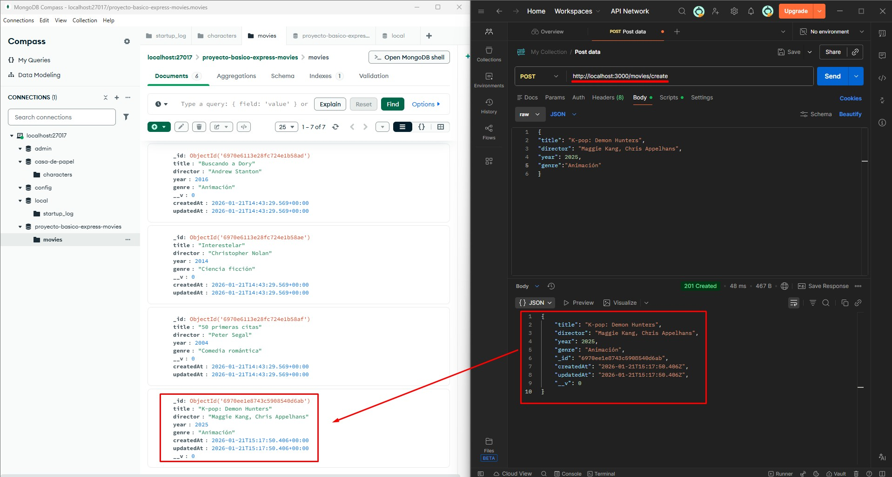
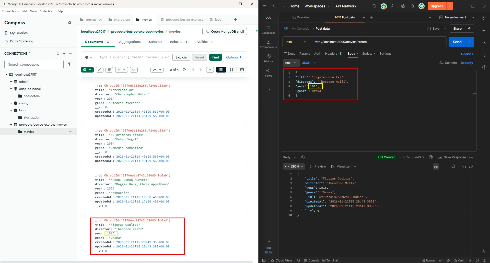
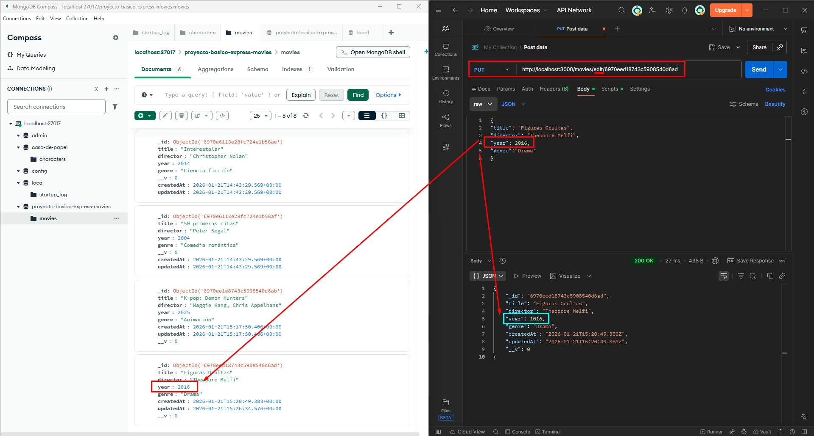
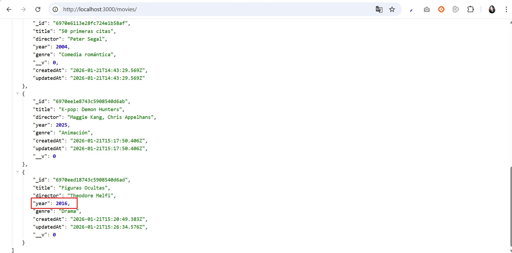
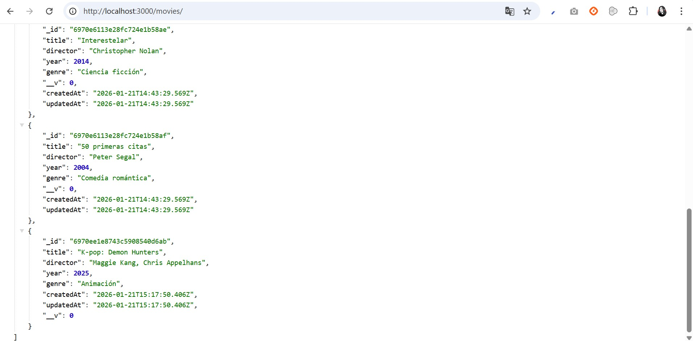

# API REST de Películas - Guía de Pruebas y Endpoints

Este documento detalla las pruebas de funcionamiento de la API realizadas mediante **Postman**, **MongoDB Compass** y la visualización en **Localhost**, documentando el ciclo de vida completo de los datos (CRUD).

## Guía de Funcionamiento y Capturas

## 1. POST: Añadir Nueva Película
Se realiza la creación de un nuevo registro en la base de datos.
* **Proceso**: Añadimos la película *K-pop: Demon Hunters*.
* **Resultado**: El servidor procesa el JSON y genera un nuevo documento en MongoDB.

---

### 2. PUT: Modificar Película (Corrección de Datos)
Demostración de la capacidad de actualización de la API ante errores en la entrada de datos.

* **Fase 1**: Se añade la película *Figuras Ocultas* con el año de lanzamiento incorrecto.

* **Fase 2**: Verificación de la película con el dato erróneo en el navegador.

* **Fase 3**: Se modifica el año a través de Postman y se verifican los cambios en tiempo real en la base de datos.

* **Fase 4**: Verificación final en el navegador con el dato corregido.

---

### 3. DELETE: Borrar una Película
Gestión de eliminación de registros y persistencia.

* **Acción**: Se solicita el borrado de una película específica a través de su ID en Postman.
* **Validación en DB**: La base de datos reduce su contador de 8 a 7 películas.

* **Validación en Cliente**: La película deja de aparecer en el listado de `localhost:3000/movies`.

---

## Tecnologías y Herramientas
* **Backend**: Node.js & Express.
* **Base de Datos**: MongoDB & Mongoose.
* **Cliente de API**: Postman.
* **Gestión de DB**: MongoDB Compass.